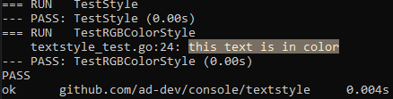

# ASCII table (`table` package)

```go

package main

import (
    "os"
    "github.com/ad-dev/console/table"
)

func main () {
    t := table.New(8, false, os.Stdout)
    t.AddHeader([]string{"h1", "h2"})
    t.AddRow([]string{"1", "2", "3"})
    t.AddFooter([]string{"Total: something"})
    t.Display()
}
```
## Output

```
+---------+---------+-----------------+
|      h1 |      h2 |                 |
+---------+---------+-----------------+
|       1 |       2 |               3 |
+---------+---------+-----------------+
|         |         |Total: something |
+---------+---------+-----------------+
```

# `textstyle` package

## FormatString(...)

```go
package main

import (
	"fmt"

	"github.com/ad-dev/console/textstyle"
)

func main() {
	fmt.Println(
		textstyle.FormatString("this text is in color", 38, 2, 255, 240, 200, 48, 2, 120, 110, 100),
	)
}
```
## Test output



More about [ANSI escape sequences](https://en.wikipedia.org/wiki/ANSI_escape_code)
