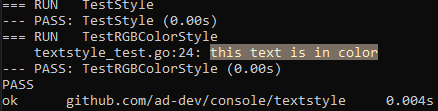

# ASCII table (`table` package)

```go

package main

import (
    "os"
    "github.com/ad-dev/console/table"
)

func main () {
    t := table.New(8, false, os.Stdout)
    t.AddHeader([]string{"h1", "h2"})
    t.AddRow([]string{"1", "2", "3\n42\n00"})
    t.AddFooter([]string{"Total: something"})
    t.Display()
}
```
## Output

```
+---------+---------+-----------------+
|      h1 |      h2 |                 |
+---------+---------+-----------------+
|       1 |       2 |               3 |
|         |         |              42 |
|         |         |              00 |
+---------+---------+-----------------+
|         |         |Total: something |
+---------+---------+-----------------+
```

# `textstyle` package

## FormatString(...)

```go
package main

import (
	"fmt"

	"github.com/ad-dev/console/textstyle"
)

func main() {
	fmt.Println(
		textstyle.FormatString(
            "this text is in color",
            38,2, 255, 240, 200, 48, 2, 120, 110, 100,
        ),
	)
}
```
## Test output



## FormatHyperlink(...)

```go
package main

import (
	"fmt"

	"github.com/ad-dev/console/textstyle"
)

func main() {
	fmt.Println(
		textstyle.FormatHyperlink("https://example.com", "This is a link"),
	)
}
```

## Output

```
\033]8;;https://example.com\033\\This is a link\033]8;;\033\\
```

Links

* [ANSI escape sequences](https://en.wikipedia.org/wiki/ANSI_escape_code)
* [OSC 8](https://gist.github.com/egmontkob/eb114294efbcd5adb1944c9f3cb5feda)
* [OSC 8 adoption in terminal emulators](https://github.com/Alhadis/OSC8-Adoption/)
* [List of terminal emulators](https://en.wikipedia.org/wiki/List_of_terminal_emulators)
